# Credit_Risk_Analysis

## Overview of the analysis
The purpose of this analysis is to evaluate the performance of 6 different machine learning models in order to predict credit risk.

## Results

### 1. Naive Random Oversampling

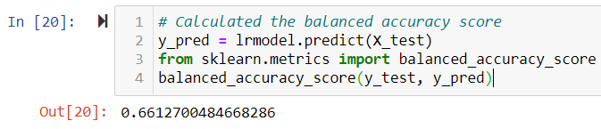

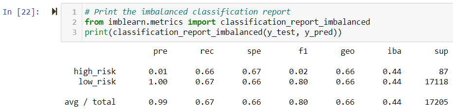

- Balanced accuracy score: 66%

- Precision:
  - High Risk: 0.01
  - Low Risk: 1.00

- Recall: 
  - High Risk: 0.66
  - Low Risk: 0.67

### 2. SMOTE Oversampling

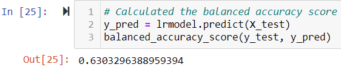

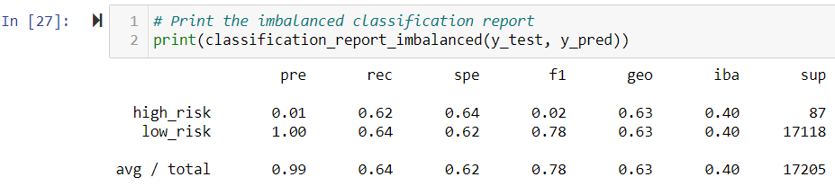

- Balanced accuracy score: 63%

- Precision:
  - High Risk: 0.01
  - Low Risk: 1.00

- Recall: 
  - High Risk: 0.62
  - Low Risk: 0.64

### 3. Undersampling

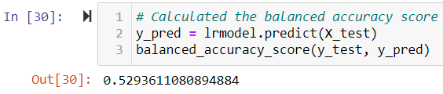

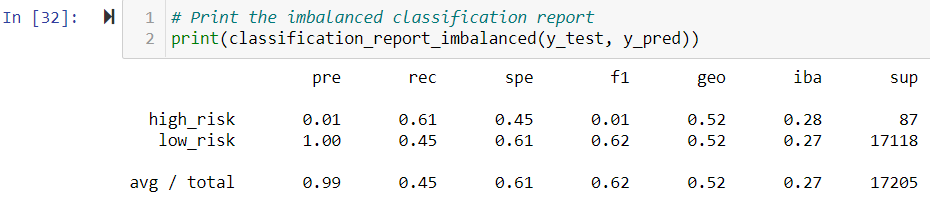

- Balanced accuracy score: 53%

- Precision:
  - High Risk: 0.01
  - Low Risk: 1.00

- Recall: 
  - High Risk: 0.61
  - Low Risk: 0.45

### 4. Combination (Over and Under) Sampling

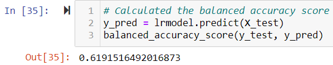

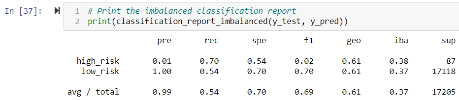

- Balanced accuracy score: 62%

- Precision:
  - High Risk: 0.01
  - Low Risk: 1.00

- Recall: 
  - High Risk: 0.70
  - Low Risk: 0.54

### 5. Balanced Random Forest Classifier

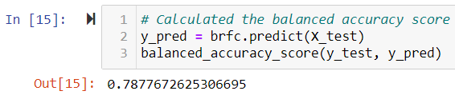

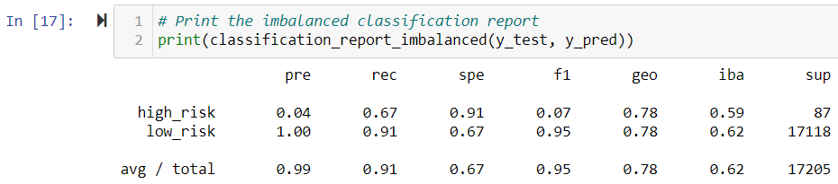

- Balanced accuracy score: 79%

- Precision:
  - High Risk: 0.04
  - Low Risk: 1.00

- Recall: 
  - High Risk: 0.67
  - Low Risk: 0.91

### 6. Easy Ensemble AdaBoost Classifier

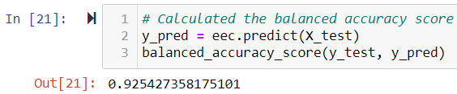

- Balanced accuracy score: 93%

- Precision:
  - High Risk: 0.07
  - Low Risk: 1.00

- Recall: 
  - High Risk: 0.91
  - Low Risk: 0.94

## Summary

Summarize the results of the machine learning models, and include a recommendation on the model to use, if any. If you do not recommend any of the models, justify your reasoning.

There is a summary of the results (2 pt)
There is a recommendation on which model to use, or there is no recommendation with a justification (3 pt)